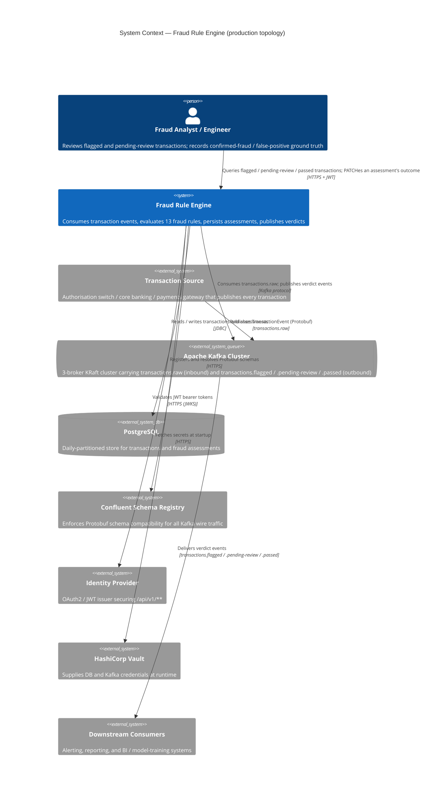

# System Context — Fraud Rule Engine

C4 Model, Level 1 (Context). Scope: production topology (`int`/`qa`/`load`/`prod` profiles),
where Kafka is the only transaction-ingestion path. See the assumptions note at the bottom for
how the `local`/`standalone` dev profiles differ from this picture.

- **Kafka is the only ingestion path in this topology.** There is no HTTP endpoint for submitting a
  transaction in `int`/`qa`/`load`/`prod` — confirmed via `TransactionConsumer`
  (`@Profile("!standalone & !local")`) and the complete absence of any unprofiled `POST` transaction
  endpoint (`DESIGN.md` §3 states this explicitly as a deliberate decoupling decision, not a gap).
- **The Fraud Analyst's only write action is `PATCH /api/v1/transactions/{id}/outcome`** — recording
  a confirmed-fraud/false-positive verdict on an assessment that already exists. Every other endpoint
  under `/api/v1/**` is read-only; this diagram folds that single write into the same "Queries...;
  PATCHes" relationship rather than drawing a second arrow, since it's the same actor over the same
  channel.
- **Schema Registry and Vault are production-only externals.** `local`/`standalone` profiles use JSON
  Kafka serialisation (no Schema Registry) and plaintext config defaults (Vault import is
  `optional:` and effectively unused) — see the assumption note below.
- **The Identity Provider is bypassed entirely in `local`/`standalone`/`test`** (`SecurityConfig`'s
  `noSecurityFilterChain` bean, `@Profile({"local","test","standalone"})`) — this diagram shows the
  secured, production-representative topology.

## Assumptions / things to verify

- **This diagram intentionally omits the `local`/`standalone` dev topology.** Those profiles replace
  the entire left-hand side of this diagram with a synchronous HTTP stub
  (`StandaloneTransactionController`, `POST /api/v1/standalone/submit`) that calls the rule engine
  directly and bypasses Kafka, Schema Registry, and JWT entirely — confirmed via
  `TransactionConsumer`/`AssessmentProducer`'s `@Profile("!standalone & !local")` gating and
  `SecurityConfig`'s profile-gated security chains. If a diagram of the dev/demo topology is wanted
  separately, it would look meaningfully different from this one, not just a subset of it.
- **"Downstream Consumers" and "Transaction Source" are inferred, not concrete systems in this repo.**
  Nothing in the codebase names a specific upstream publisher or downstream subscriber — the topic
  names (`transactions.raw`, `transactions.flagged`, etc.) and `DESIGN.md`'s stated intent
  ("alerting, reporting, model training") are the only evidence. Verify these boxes represent your
  actual upstream/downstream systems, not placeholders that happen to match generic fraud-pipeline
  naming.
- **Vault's relationship to the running service is at startup/config-refresh time only** (Spring Cloud
  Vault Config, `spring.config.import: optional:vault://`), not a per-request dependency — drawn as a
  system relationship rather than an inline data flow to avoid implying it's on the hot path.
