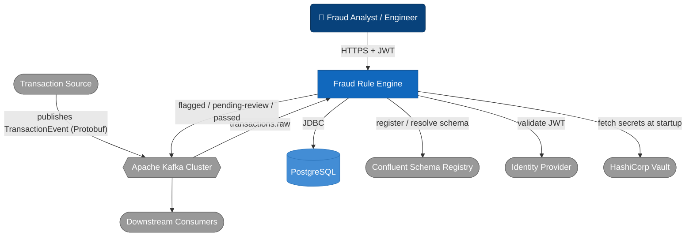

# System Context — Fraud Rule Engine

C4 Model, Level 1 (Context). Scope: production topology (`load-test`/`prod`), where Kafka is
the only ingestion path. See "Assumptions" for how `local`/`standalone` differ.

- Kafka is the only ingestion path in `load-test`/`prod`; no HTTP submission endpoint exists there.
- The Analyst's only write action is `PATCH .../outcome`; everything else is read-only.
- Schema Registry and Vault are production-only: `local`/`standalone` skip both.
- The IDP is bypassed entirely in `local`/`standalone`/`test` (`SecurityConfig`'s `noSecurityFilterChain`).

## Assumptions / things to verify

- **Production topology only.** `local`/`standalone` swap in a synchronous HTTP stub
  (`StandaloneTransactionController`) that bypasses Kafka, Schema Registry, and JWT entirely. It's a
  genuinely different diagram, not a subset of this one.
- **"Downstream Consumers" and "Transaction Source" are inferred**, not concrete systems in this
  repo, based on topic names and `DESIGN.md`'s stated intent ("alerting, reporting, model
  training"). Verify against your actual upstream/downstream systems.
- **Vault access is a startup-time concern** (Spring Cloud Vault Config), not per-request. It's shown as
  one relationship, not a hot-path dependency.
