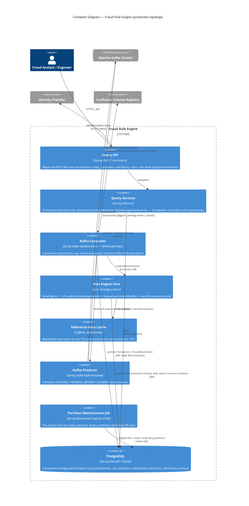

# Container Diagram — Fraud Rule Engine

C4 Model, Level 2 (Container). This service ships as a single Spring Boot JAR / Docker image — there
is no microservice split. The "containers" below are the major internal building blocks (packages
and Spring-managed component groups), shown as separate boxes because C4 Container diagrams model
"how the system is decomposed" regardless of whether each piece is independently deployable. See the
assumptions note at the bottom.

Vault access happens once, at process startup (Spring Cloud Vault Config resolving
`spring.config.import: optional:vault://`), before any container above is doing request work — it
isn't owned by one specific container, so it's omitted from this diagram's `Rel` arrows and shown
only at the process level in `01-context.md`.

- **Exactly-once semantics via a chained transaction.** The Kafka Consumer's DB write and the Kafka
  Producer's publish are wrapped in one `ChainedKafkaTransactionManager` transaction (Kafka TX opens
  → DB TX opens → work happens → DB commits → Kafka commits) — both succeed or both roll back
  together, not modeled as two separate containers with independent commit points.
- **Two independent idempotency guards protect against Kafka redelivery**, not one: `findByIdOnly`
  skips re-inserting the `Transaction` row if it exists, and a separate `findByTransactionId` check
  skips re-evaluation, re-save, *and* re-publish entirely if a `FraudAssessment` already exists for
  that transaction — both must be checked; the second was a real bug (fixed) when only the first
  existed.
- **Caching is asymmetric by design, and routed through a dedicated bean on purpose.**
  `ReferenceDataCache` exists as its own `@Component` (rather than methods on
  `EvaluationContextBuilder`) specifically because Spring's `@Cacheable` proxy doesn't intercept
  self-invoked calls — routing through a separate collaborator bean guarantees the proxy is always in
  the call path.
- **The Rule Engine Core is shared by two different ingress paths**, not duplicated: the production
  Kafka Consumer and the dev/demo HTTP stub (`StandaloneTransactionController`, out of scope for this
  production-topology diagram — see `01-context.md`'s assumptions) both call the exact same
  `RuleEngine.evaluate()`.
- **Kafka Consumer and Kafka Producer are entirely absent outside production.** Both are
  `@Profile("!standalone & !local")` — under `local`/`standalone`, only Query API, Query Services,
  Rule Engine Core, Reference Data Cache, and the database remain active, wired to a different
  (unshown here) HTTP ingress instead.
- **Listener concurrency (6) is deliberately matched to `transactions.raw`'s partition count (6)**,
  itself keyed by `customerId` — this preserves per-customer ordering (required by every window-based
  rule, e.g. `VelocityRule`) while parallelising across customers, one thread per disjoint partition
  subset.

## Assumptions / things to verify

- **These are logical containers inside one deployable JAR, not independently scalable services.**
  Strict C4 Container diagrams often depict independently deployable/runnable units; here every box
  inside the `System_Boundary` runs in the same JVM process and scales as one unit. This diagram
  favors "how the system is decomposed" over "how it's deployed" — flag if a deployment-unit view
  (single box: "Fraud Rule Engine JAR") is what's actually wanted instead.
  Doubling as evidence: `docker-compose.yml` runs a single `fraud-engine` container per environment.
- **"Query Services" is drawn as one container for three separate `@Service` classes**
  (`TransactionQueryService`, `AssessmentOutcomeService`, `RuleManagementService`) — they share no
  code and aren't a cohesive module by any code-level grouping (no shared package-private state,
  no common interface); grouped here only because they play the identical structural role
  (controller-to-repository delegation) and drawing three near-identical boxes added no diagrammatic
  value. Verify this simplification is acceptable for your purposes.
- **The Partition Maintenance Job's relationship to `db` is native SQL DDL** (`CREATE TABLE ... PARTITION OF`,
  `DROP TABLE`), not JPA entity access like every other container's — kept as one `db` box for
  simplicity rather than splitting "DDL access" from "DML access" into separate arrows.
