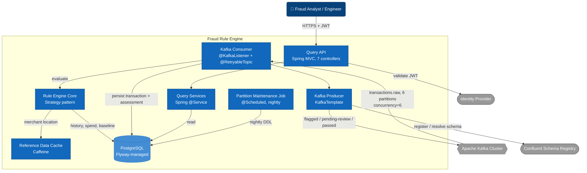

# Container Diagram — Fraud Rule Engine

C4 Model, Level 2 (Container). Ships as a single Spring Boot JAR / Docker image — there's no
microservice split. The boxes below are the major internal building blocks, not independently
deployable units. See "Assumptions".

Vault isn't shown here — it's a one-time startup config fetch, not owned by any single container
(see `01-context.md`).

- Exactly-once: DB write + Kafka publish share one `ChainedKafkaTransactionManager` transaction — both commit or both roll back.
- Two idempotency guards, not one: `findByIdOnly` (transaction row) and `findByTransactionId` (assessment) — both must pass to skip a Kafka redelivery.
- `ReferenceDataCache` is its own bean, not methods on `EvaluationContextBuilder` — Spring's `@Cacheable` proxy skips self-invoked calls.
- Rule Engine Core is shared by two ingress paths (Kafka consumer in prod, HTTP stub in local/standalone) — same `RuleEngine.evaluate()` call, not duplicated.
- Kafka Consumer/Producer are `@Profile("!standalone & !local")` — absent entirely outside production.
- Listener concurrency (6) matches `transactions.raw`'s 6 partitions (customer-keyed) — preserves per-customer ordering while parallelising.

## Assumptions / things to verify

- **Logical containers inside one JAR**, not independently deployable services —
  `docker-compose.yml` runs a single `fraud-engine` container per environment.
- **"Query Services" groups three unrelated classes** (`TransactionQueryService`,
  `AssessmentOutcomeService`, `RuleManagementService`) — same structural role, no shared code.
- **Partition Maintenance Job talks to `db` via native DDL**, not JPA — kept in the same box as
  everything else for simplicity.
