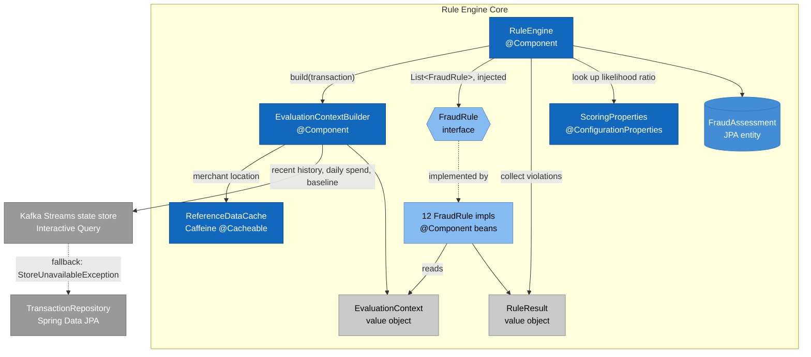

# Component Diagram — Rule Engine Core

C4 Model, Level 3 (Component). Zooms into "Rule Engine Core" from `02-container.md`: the
fraud-evaluation flow shared by the Kafka consumer (production) and the standalone HTTP stub
(dev/demo) — `RuleEngine.evaluate(Transaction)` is the single entry point either caller invokes.

- No short-circuiting — every enabled rule runs regardless of earlier violations; priority only controls order.
- Scoring is log-odds (naive-Bayes), not point-summing — each violation's likelihood ratio (keyed by `RULE_NAME:SEVERITY`) combines additively in log-space, converted to a probability via sigmoid.
- Two thresholds, not one: `fraudProbabilityThreshold` → FLAGGED, `reviewProbabilityThreshold` → PENDING_REVIEW.
- `EvaluationContext` is built once per transaction and shared read-only across all 12 rules — avoids per-rule DB round-trips.
- Adding a rule needs no `RuleEngine` change — `List<FraudRule>` injection auto-collects every `@Component` implementation.
- A missing likelihood-ratio entry falls back to a per-severity default and logs a warning, not a hard failure.

## Assumptions / things to verify

- **The 12 rule implementations are collapsed into one box** — identical shape, no calls between
  them. Full list is in `RuleEngine.getRules()`.
- **`TransactionRepository`/the Kafka Streams state store are shown reaching in from the container
  level** — the state store is the primary path (recent history, daily spend, and the
  `CustomerAmountAnomalyRule` baseline all come from it), Postgres is a fallback only, not a second
  parallel read on every evaluation.
- **`FraudAssessment` is the flow's terminal output** — the actual `save()` and Kafka publish happen
  one level up, in `02-container.md`.
