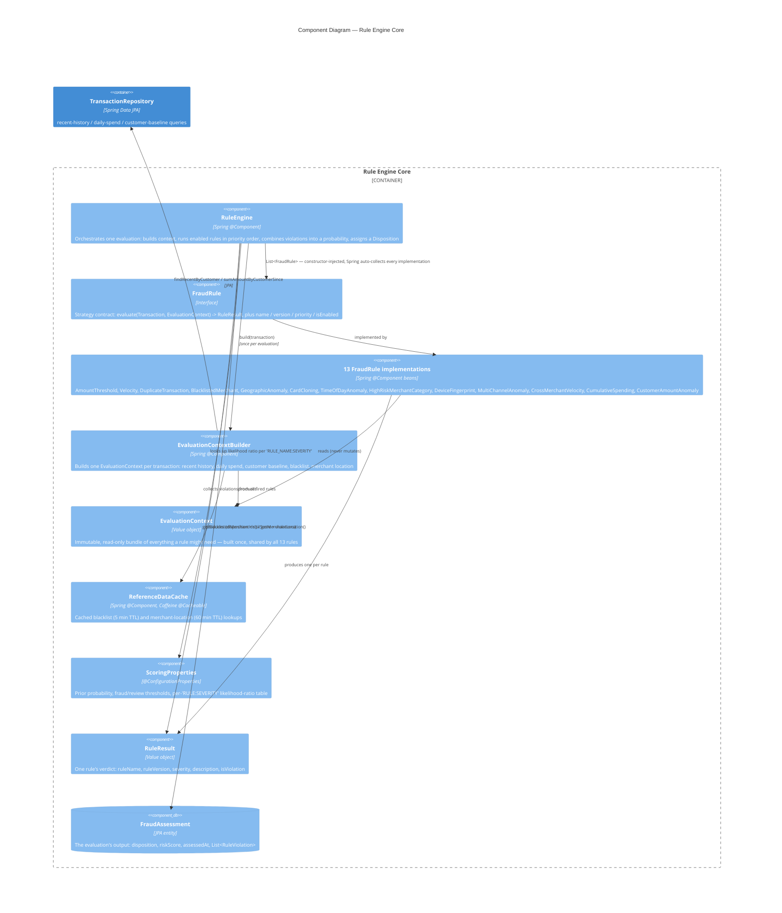

# Component Diagram — Rule Engine Core

C4 Model, Level 3 (Component). Zooms into the "Rule Engine Core" container from `02-container.md`:
the fraud-rule-evaluation flow shared by both the Kafka consumer (production) and the standalone
HTTP stub (dev/demo) — `RuleEngine.evaluate(Transaction)` is the single entry point either caller
invokes.

- **No short-circuiting.** Every *enabled* rule runs on every transaction, regardless of earlier
  violations — priority order (1–13) only controls evaluation sequence and, incidentally, which
  violation's description a caller sees first in logs; it does not stop later rules from also firing.
- **Scoring is log-odds (naive-Bayes) combination, not point-summing.** Each violation contributes a
  calibrated likelihood ratio, keyed by `"RULE_NAME:SEVERITY"` (e.g. `VELOCITY:CRITICAL` and
  `VELOCITY:HIGH` are calibrated independently, since `VelocityRule` escalates its own severity at
  runtime). Ratios combine additively in log-space and convert back to a probability via sigmoid —
  chosen specifically so one `HIGH`-severity rule alone can't push a legitimate large purchase over
  the fraud threshold, which flat point-summing previously allowed.
- **Two independent thresholds drive a three-way `Disposition`**, not one: `fraudProbabilityThreshold`
  → `FLAGGED`, `reviewProbabilityThreshold` (lower) → `PENDING_REVIEW`, below both → `CLEARED`.
- **`EvaluationContext` is built exactly once per transaction and shared read-only across all 13
  rules** — avoids 13 separate round-trips to `TransactionRepository`. The one exception:
  `CustomerAmountAnomalyRule`'s longer-window baseline-history query is gated behind its own
  `enabled` flag inside `EvaluationContextBuilder`, specifically to skip that second query when the
  rule is turned off.
- **Adding a new rule requires no change to `RuleEngine` itself.** `List<FraudRule>` constructor
  injection means Spring auto-collects every `@Component` implementing the interface — this is the
  Open/Closed principle showing up structurally, not just as a design claim.
- **A missing likelihood-ratio entry isn't a hard failure.** If a fired rule's
  `"RULE_NAME:SEVERITY"` key has no entry in `ScoringProperties.likelihoodRatios`, `RuleEngine` logs
  a warning and falls back to a per-severity default ratio instead.

## Assumptions / things to verify

- **The 13 concrete rule implementations are collapsed into one box.** Drawing all 13 individually
  would add boxes without adding relationships worth distinguishing — every rule has the identical
  shape (`Transaction` + `EvaluationContext` in, `RuleResult` out) and none of them call each other or
  any other component directly. The full list (with priority numbers) is in the component's
  description above and in `RuleEngine.getRules()`; verify this simplification doesn't hide anything
  you specifically wanted surfaced (e.g. if a particular rule's internal logic is the actual point of
  interest, it belongs in a rule-specific diagram, not this one).
- **`TransactionRepository` is shown as a `Container`-level box reaching into this component
  diagram**, not expanded into its own component — it's the one point where this "core domain logic"
  diagram touches persistence, included because `EvaluationContextBuilder`'s queries are central to
  the evaluation flow being diagrammed, not because repositories generally belong at component level.
- **`FraudAssessment` is drawn as the flow's terminal output (`ComponentDb`, since it's a JPA
  entity)**, but this diagram stops at object construction — `RuleEngine.evaluate()` returns the
  assessment to its caller (Kafka consumer or the standalone HTTP stub); neither the actual
  `save()` call nor the Kafka publish is this component's responsibility, and both are already shown
  at the container level in `02-container.md`.
